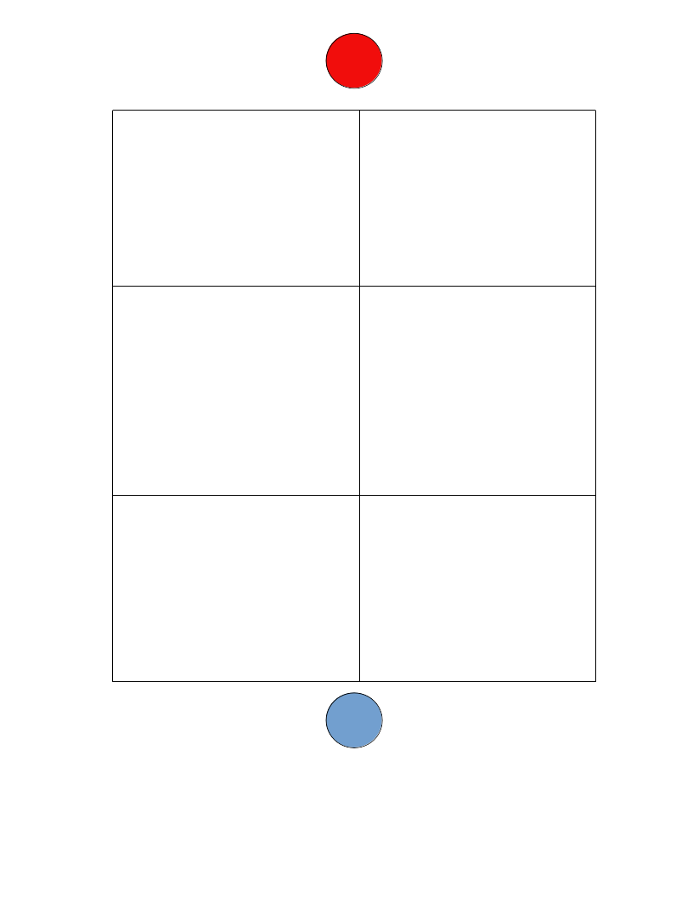

# HELLHOUSE

## TJDRZ

### Turn based escape the killer game vs AI opponent

**Base Game:**

- Top view game
- Killer starts at the top next to the front door, player starts on the bottom at the back of house
- Turn 1: Player can either move up into right room or left room, killer can either move down into right room or left room
- Repeat until player moves up and escapes or runs into the killer and dies

**Future Feature Ideas:**

- Player and killer can move forward and backward throughout the columns (perhaps a reasoning given to do so, such as an alert was activated)
- Multiple columns instead of the starting 2 (perhaps a middle hallway with full vision down the lane)

